# Template Matching

Template-Matching en escala de grises invariente a la rotación, escala, traslación, brillo y contraste. El algoritmo se basa en tres pasos de filtrados sucesivos en el que se excluyen los pixeles que no tienen oportunidad de matchear con el template. 

El primer paso es el filtro **Cifi** o 'Circular Sampling Filter' que usa las proyecciones de la imagen y el template en un conjunto de circulos para detectar los "pixeles" de primer grado. Para cada pixel candidato, tambien se calcula el factor de posible escala.

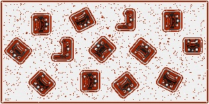

Los pixeles rojos representan los primeros seleccionados por **Cifi**

El segundo paso es el filtro **Rafi** o 'Radial Sampling Filter' que utiliza las proyecciones de las imagenes en un conjunto de lineas radiales para actualizar los pixeles de primer grado a segundo grado. Rafi tambien estima el posible angulo de rotación para cada pixel de segundo grado.

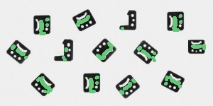

Los pixeles verdes representan los segundos seleccionados por **Rafi**

El ultimo paso es el filtro **Tefi** o 'Template Matching Filter' que hace un template matching entre los pixeles anteriormente mencionados (utilizando los datos de escala y rotacion probable) con la imagen original. Luego mediante una evaluacion con un threshold definido por el algoritmo se decide cuales son los pixeles resultado.

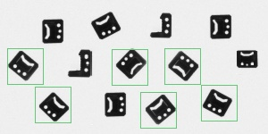

## Algunos ejemplos de pruebas:

### Ejemplo 1:
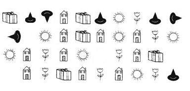

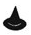

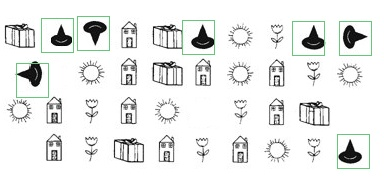

- Falsos positivos: 0
- Falsos negativos: 0

### Ejemplo 2:
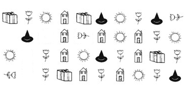

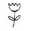

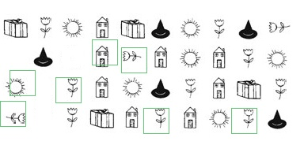

- Falsos positivos: 2
- Falsos negativos: 7

### Ejemplo 3:
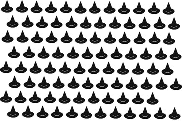

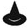

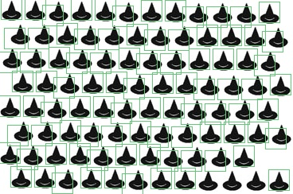

- Falsos positivos: 0
- Falsos negativos: 3

### Ejemplo 4:

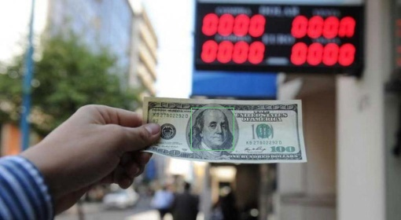

- Falsos positivos: 0
- Falsos negativos: 0

### Ejemplo 5:
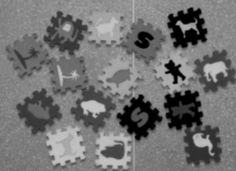

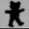

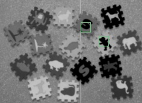

- Falsos positivos: 1
- Falsos negativos: 1

### Ejemplo 6:

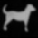

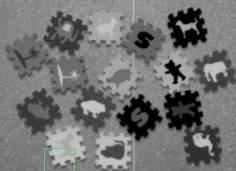

- Falsos positivos: 0
- Falsos negativos: 1

### Ejemplo 7:
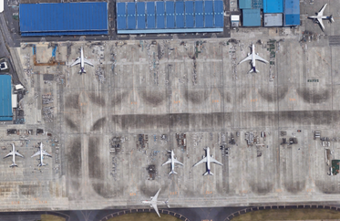

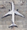

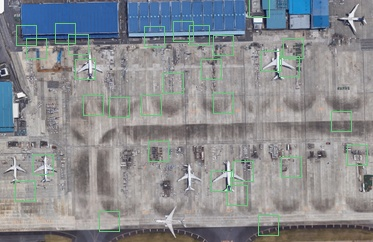

- Falsos positivos: 16
- Falsos negativos: 3

